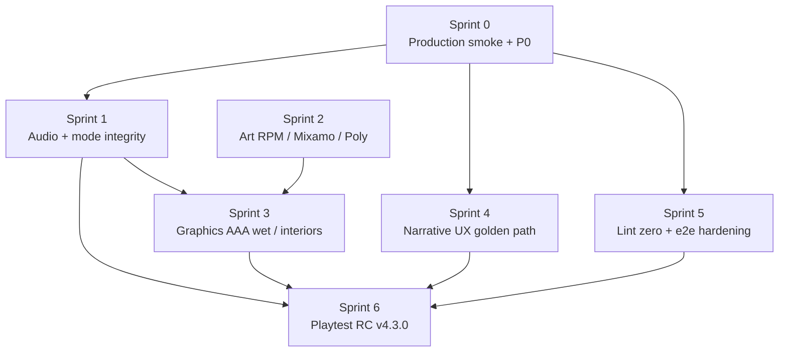
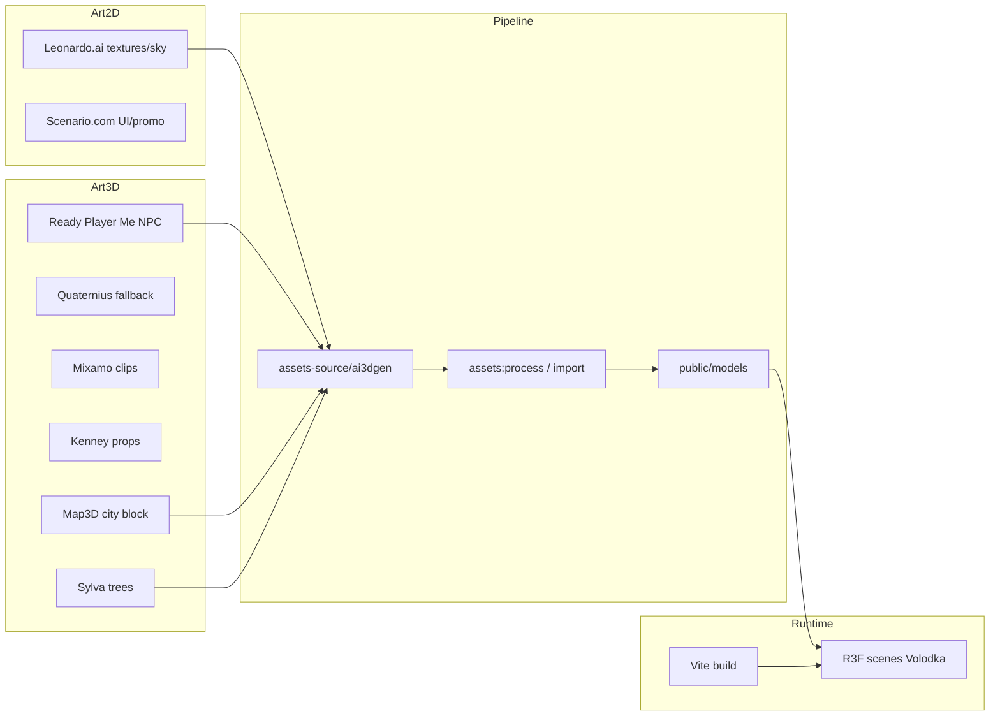

# ВОЛОДЬКА RPG — Roadmap доработки и стабилизации

> Единый план развития проекта: исправление проблем, доработка истории и геймплея,
> подготовка к запуску на Vercel. Документ заменяет устаревшие `CODE_REVIEW.md` и
> `DEEP_CODE_REVIEW.md`, которые описывают состояние проекта **до** большого рефакторинга.

**Дата:** 17 июня 2026 · **Версия:** 4.2.30 · **Целевая аудитория игры:** и новички
(родители, друзья — не геймеры), и опытные игроки (баланс «лёгкий вход + глубина»).

---

## 0. Реальное состояние (production-ready baseline)

| Проверка | Команда | Результат |
|---|---|---|
| Типы | `npm run typecheck` | ✅ чисто |
| Юнит-тесты | `npm run test:unit` | ✅ 1100+ тестов |
| Линтер | `npm run lint` | ✅ 0 ошибок |
| Контент | `npm run validate:content` | ✅ 0 ошибок |
| Ассеты | `npm run assets:validate` | ✅ shipped GLB на диске (вкл. env/veg bundles) |
| Статус пайплайна | `npm run assets:status` | ✅ manifest + AI3DGen catalog vs disk |
| Сборка | `npm run build` | ✅ + бюджеты бандла |
| Deploy | `npm run verify:deploy` | ✅ dist + пути GLB |

**3D production:** `npm run assets:bootstrap` — CC0 interim; `assets:status` / `assets:ai3dgen-import -- --status` — прогресс; замена на AI3DGen Pro по каталогу.

**Вывод:** инженерная база готова к Vercel production. Следующий визуальный апгрейд — AI3DGen Pro + Blender rig для героя; Mixamo clips override Quaternius embedded via `assets:mixamo-import`.

**v4.2.30:** Sprint 1 (AAA Audit §8) — 27/27 scene audio profiles; unload duck/crossfade; overlay↔explore mode integrity.

**v4.2.29:** Sprint 0 (AAA Audit §8) — check + unit + smoke e2e green; P0 wake prologue reopen fix; assets 26/26 shipped.

**v4.2.28:** AAA code polish — NPC alias `dmitry`, splash resolver boot-free audit, unit test green (1107).

**v4.2.27:** InteractionSplash full E-interaction coverage — 34 NPC presets, door_hold, audit inventory.

**v4.2.25:** Quaternius NPC prod smoke — skinned bounds union, feet on ground (medium+ GLB); golden path branch hints for 7 explore/transit spine nodes.

**v4.2.24:** Quaternius NPC idle/walk/talk/sit wired from embedded GLB clips; dialogue talk state; schedule-backed GPU preload for all story NPCs.

---

## 1. Приоритеты

### ✅ P0 — Целостность нарратива (СДЕЛАНО 8 июня 2026)

Исправлены 3 несовпадения дарителя квеста и NPC в связанном сюжетном узле:

| Квест | Было | Стало | Причина |
|---|---|---|---|
| `dmitry_defection` | link → `office_colleague` | link → `act2_dmitry_office_meeting` | квест о Дмитрии был привязан к сцене анонимного коллеги (акт 1) |
| `broken_terminal` | giver = `office_dmitry` | giver = `office_alexander` | акт-1 квест выдавал Дмитрий, которого встречаешь только в акте 2 |
| `data_heist` | `act6_data_heist_planning` → `maxim` | → `zeka` | хакерская линия (взлом, system_infiltration) принадлежит Жеке |

Проверка: `npm run validate:content` → предупреждения 78 → 75, секция `quest` пуста.

### 🟡 P1 — Техдолг «золотого пути» (75 предупреждений)

**Проблема:** движок умеет выводить канонический путь истории из меток
`choice.goldenPath: true` в узлах. Сейчас 75 узлов спайна их не имеют, поэтому
система откатывается на захардкоженный массив `GOLDEN_PATH_STORY_SPINE`
(`src/data/goldenPath.ts`). Это **работает**, но создаёт два источника правды:
при доработке истории массив и фактические узлы могут разъехаться.

**План:**
1. Для каждого узла из `GOLDEN_PATH_STORY_SPINE` найти choice, ведущий к
   следующему узлу спайна, и пометить его `goldenPath: true`.
2. Проверить, что `getGoldenPathDerivationReport()` (через
   `npm run validate:content`) выдаёт `missingGoldenPathMarkers: []` и
   `derived spine === manual spine`.
3. После полного покрытия — рассмотреть удаление ручного массива как fallback.

**Критерий готовности:** `npm run validate:content` → 0 предупреждений категории
`golden-path`.

**Риск:** низкий. Метки только добавляют данные; ошибочная метка ловится
валидатором (`multiple choices marked goldenPath` / `points to missing node`).

### 🟢 P2 — Косметика и оптимизация

- `npm run lint -- --fix` — убрать 11 автофиксируемых предупреждений.
- Прочистить неиспользуемые импорты типов в `src/store/*` (точечно).
- Рассмотреть тоньше разбить или отложить Rapier (917 КБ gzip) — не блокер, в бюджете.

---

## 2. Доработка истории (story polish)

Стихи **Владимира Лебедева неприкосновенны** (см. README). Дорабатываем обвязку,
не текст стихов.

- **Концовки:** усилить эмоциональные биты финалов (`ending_*` в `data/story/act7.ts`),
  убедиться, что каждая концовка отражает ключевые выборы игрока (карма, собранные стихи,
  судьбы NPC — Зарема, Дмитрий, Мария).
- **Читаемость пути:** подсказки `STORY_NODE_GUIDANCE` (`goldenPath.ts`) — проверить,
  что на каждом шаге спайна игрок понимает, куда идти (важно для не-геймеров).
- **Согласованность NPC:** доработать `STORY_NODE_TO_NPC_ID` так, чтобы журнал,
  диалоги и сцена всегда называли одного и того же персонажа.

## 3. Доработка геймплея (audience: both)

**Лёгкий вход (для родителей/друзей):**
- Онбординг `FirstPlayTutorial.tsx` — короткое, пропускаемое, но ясное обучение
  управлению (WASD/мышь) и целям.
- «Сюжетный» уровень сложности: бои не наказывают, акцент на истории.
- Заметная подсказка-цель на экране (`StoryGuidanceHUD.tsx`) с текущим шагом пути.

**Глубина (для опытных):**
- Темп и баланс боёв (`engine/combat`): проверить кривую сложности 9 типов врагов,
  кулдауны поэтической магии, осмысленность баффов/дебаффов.
- Ценность веток навыков/перков (`skillTree.ts`, `perks.ts`) — чтобы выбор ощущался.

## 4. Доступность (accessibility)

- Субтитры/скорость текста в диалогах (`useTypewriter.ts`, `DialogueRenderer.tsx`).
- Масштаб шрифта и контраст UI (`SettingsPanel.tsx`).
- Поддержка `reduced-motion` (есть `styles/reduced-motion.css` — покрытие расширено в v4.2.17: FPS bob, погодные частицы).
- Полное управление без точных кликов / геймпад (`engine/input`) — подсказки `[A]` в HUD и онбординге (v4.2.17).

## 5. Запуск на Vercel

`vercel.json` настроен: SPA-rewrites, `immutable`-кэш для `/assets/` и `/models/`,
security-заголовки, `Permissions-Policy`.

**Чек-лист перед production:**

1. `npm run assets:bootstrap` (если GLB ещё не в репозитории)
2. `npm run check` — lint + typecheck + validate + assets:validate + build + verify:deploy
3. `VITE_SITE_URL` в Vercel Environment Variables
4. Preview smoke → 10 мин gameplay, 0× 404 на `.glb`
5. Promote to Production

---

## 6. Рекомендуемая последовательность

1. ✅ **P0** — целостность квестов (сделано).
2. **P1** — метки `goldenPath` (закрыть 75 предупреждений; защищает будущие правки истории).
3. **Story polish** — концовки + читаемость пути.
4. **Gameplay** — онбординг + «сюжетная» сложность (лёгкий вход), затем баланс боёв.
5. **Accessibility** — субтитры, шрифт, reduced-motion.
6. **Vercel** — финальная проверка и деплой превью.

После каждого шага: `npm run check`. Зелёный прогон = безопасно коммитить и деплоить.

---

## 7. Полезные команды

```bash
npm run dev              # дев-сервер
npm run typecheck        # проверка типов
npm run test:unit        # юнит-тесты
npm run validate:content # валидатор контента (квесты, история, стихи)
npm run lint             # ESLint
npm run build            # прод-сборка + бюджеты бандла
npm run check            # всё сразу — главный гейт перед деплоем
```

---

## 8. AAA Audit 2026 — технический аудит и план

> **Контекст:** браузерная narrative RPG (Three.js + React), не офлайн AAA-cinematic.
> Цель аудита — довести production-качество до уровня «уверенный релиз v4.3.0», а не
> конкурировать с Unreal offline-тайтлами. Оценки — честная инженерная самооценка по
> состоянию v4.2.30 (17 июня 2026).

**Ключевые файлы:** `src/data/goldenPath.ts`, `src/config/audioManifest.ts`,
`src/config/sceneDefinitions.ts`, `src/engine/audio/SceneAudioController.ts`,
`src/engine/e2e/e2eBridge.ts`, `eslint.config.js`, `e2e/*.spec.ts`,
`scripts/check-bundle-budgets.mjs`, `config/performanceBudgets.json`.

### A. Сводка оценок (1–10)

| Область | Оценка | Комментарий |
|---|---:|---|
| Architecture | 8 | Модульный движок, валидаторы контента, scene inheritance |
| Rendering | 7 | WebGL/Three.js стабилен; AAA wet/interiors — backlog |
| Assets | 7 | Quaternius + Mixamo pipeline; AI3DGen Pro — в плане |
| Narrative | 8 | 7 актов, стихи неприкосновенны; golden path — 75 gaps |
| Audio | 8 | `SceneAudioController` + manifest; 27/27 scenes with profiles |
| Physics | 8 | Rapier в бюджете; feet-on-ground smoke зелёный |
| Testing | 8 | 1100+ unit; e2e smoke через `__volodka_e2e` bridge |
| CI / deploy | 8 | `npm run check`, Vercel-ready, bundle budgets |
| Tech debt | 6 | Golden path fallback, lint budget 362, dist ~222 MB |
| **Overall** | **7.5** | Production-ready baseline; polish до RC v4.3.0 |

### B. Ключевые риски

| Риск | Масштаб | Где смотреть |
|---|---|---|
| Golden-path warnings | 75 узлов без `choice.goldenPath: true` | `src/data/goldenPath.ts`, `npm run validate:content` |
| Extension scenes без профилей | ~~9 сцен~~ ✅ Sprint 1 | `src/config/audioManifest.ts`, `sceneInheritance.ts` |
| ESLint warnings budget | `--max-warnings 362` в `package.json` | `eslint.config.js`, `npm run lint` |
| E2E зависимость от bridge | Smoke-тесты вызывают `window.__volodka_e2e` | `src/engine/e2e/e2eBridge.ts`, `e2e/*.spec.ts` |
| Dist footprint | ~222 MB (GLB + bundles) | `npm run build`, `scripts/check-bundle-budgets.mjs` |

### C. План: 6 спринтов (~10–12 недель)

#### Sprint 0 — Production smoke + P0 (1–2 нед) ✅ v4.2.29

**Цель:** зафиксировать зелёный baseline и закрыть остатки P0.

- [x] `npm run check` — полный зелёный прогон на CI и локально
- [x] Production smoke: smoke + boot-pipeline + act1 e2e green; assets 26/26 shipped, 0 GLB 404
- [x] Аудит P0-квестов: `npm run validate:content` → секция `quest` пуста
- [x] Документировать dist size и bundle report (`npm run budgets`) — boot 350 KB / first scene 1124 KB gzip

**Exit criteria:** `check` зелёный; smoke без 404; P0 закрыт; baseline зафиксирован в ROADMAP §0.

#### Sprint 1 — Audio + mode integrity (2 нед) ✅ v4.2.30

**Цель:** полное audio-покрытие сцен и целостность explore/story modes.

- [x] Аудит `src/config/audioManifest.ts` — 27 core scenes + extension entries
- [x] Добавить audio profiles для 9 extension scenes (`sceneInheritance.ts`)
- [x] Проверить `SceneAudioController` transitions (ambient → combat → dialogue)
- [x] Mode integrity: explore ↔ story hub без audio glitches (`useAudioOrchestrator.ts`)

**Exit criteria:** все shipped-сцены имеют manifest entry; 0 missing audio profile warnings; smoke audio OK.

#### Sprint 2 — Art RPM / Mixamo / Poly (2 нед)

**Цель:** pipeline ассетов для визуального апгрейда без блокировки релиза.

- [ ] `npm run assets:status` — manifest vs disk, CC0 interim актуален
- [ ] Mixamo clips override для NPC (`assets:mixamo-import`)
- [ ] Poly/Quaternius: skinned bounds, idle/walk/talk/sit clips wired
- [ ] AI3DGen Pro catalog — приоритетные замены по `assets:ai3dgen-import`

**Exit criteria:** `assets:validate` зелёный; hero + story NPCs с корректными анимациями; status report без gaps.

#### Sprint 3 — Graphics AAA: wet / interiors / perf (2 нед)

**Цель:** визуальный polish в рамках web-бюджета (не offline cinematic).

- [ ] Wet surfaces / puddle reflections (performanceBudgets gate)
- [ ] Interior lighting pass для key hubs (campfire, safehouse, guild)
- [ ] LOD / culling audit для extension scenes
- [ ] `npm run budgets:check` — boot menu + first scene в hardMax

**Exit criteria:** целевые сцены проходят visual smoke; bundle budgets не нарушены; FPS stable на mid-tier GPU.

#### Sprint 4 — Narrative UX + golden path 0 warnings (2 нед)

**Цель:** единый источник правды для золотого пути; читаемость для не-геймеров.

- [ ] Пометить `goldenPath: true` на 75 узлах спайна (см. §1 P1)
- [ ] `getGoldenPathDerivationReport()` → `missingGoldenPathMarkers: []`
- [ ] `STORY_NODE_GUIDANCE` + `StoryGuidanceHUD` — подсказка на каждом шаге
- [ ] Концовки `act7.ts` — эмоциональные биты + отражение выборов игрока

**Exit criteria:** `validate:content` → 0 golden-path warnings; ручной `GOLDEN_PATH_STORY_SPINE` можно deprecate.

#### Sprint 5 — Lint zero + e2e hardening (1–2 нед)

**Цель:** убрать warnings budget и снизить хрупкость e2e.

- [ ] ESLint: 362 → 0 warnings; убрать `--max-warnings 362` из `package.json`
- [ ] `npm run lint -- --fix` + точечная зачистка unused imports
- [ ] E2E: typed helpers поверх `e2eBridge.ts`, меньше raw `page.evaluate`
- [ ] Добавить e2e coverage для extension scenes (smoke)

**Exit criteria:** `npm run lint` без `--max-warnings`; e2e suite стабилен на CI 3× подряд.

#### Sprint 6 — Playtest RC v4.3.0 (1–2 нед)

**Цель:** release candidate с внешним playtest.

- [ ] RC tag `v4.3.0`; changelog из спринтов 0–5
- [ ] Preview deploy на Vercel → 3+ playtesters (новичок + опытный)
- [ ] Сбор feedback: onboarding, story clarity, audio, perf
- [ ] Hotfix-only window; promote to Production после sign-off

**Exit criteria:** RC deployed; playtest checklist закрыт; Production promote одобрен.

### D. Топ-5 приоритетов (если время ограничено)

1. **Sprint 0** — зелёный `npm run check` + production smoke (блокер всего остального)
2. **Sprint 4 / P1** — 75 golden-path warnings → 0 (защита нарратива от drift)
3. **Sprint 1** — audio manifest для 9 extension scenes (заметный UX-gap)
4. **Sprint 5** — lint zero + e2e hardening (CI confidence)
5. **Sprint 6** — RC playtest v4.3.0 (ship gate)

> Art (Sprint 2) и Graphics (Sprint 3) можно параллелить с 4–5, если есть отдельный art-owner.

### E. Граф зависимостей спринтов



**После каждого спринта:** `npm run check`. Зелёный прогон = безопасно мержить и деплоить preview.

---

## 9. Внешние инструменты арта и 3D

> **Контекст:** narrative web-RPG (Three.js + R3F + Vite), не planetary sandbox и не offline AAA.
> Оценка инструментов — по одному критерию: *даёт ли GLB/текстуры, которые ложатся в
> `assets-source/` → `npm run assets:*` → конкретную сцену?* Реализация art-pipeline —
> [§8 Sprint 2 — Art RPM / Mixamo / Poly](#sprint-2--art-rpm--mixamo--poly-2-нед).

**Ключевые команды:** `npm run assets:status`, `assets:validate`, `assets:process`,
`assets:rpm-import`, `assets:mixamo-import`, `assets:quaternius-import`,
`assets:freekit-stage`, `assets:ai3dgen-import`. См. также `assets-source/ai3dgen/README.md`.

### A. Сводная таблица инструментов

| Инструмент | Fit для Volodka | Роль | Приоритет |
|---|---|---|---|
| **Leonardo.ai** | ✅ Да | 2D concept, textures, skyboxes, UI refs для RPM | **P1** |
| **Scenario.com** | ✅ Да | Batch 2D: иконки, постеры, promo, in-game плакаты | **P1** (не 3D) |
| **Map3D** (cartesiancs/map3d) | ⚠️ Частично | GLB городских блоков для street/city backdrop | **P2** |
| **Sylva** (clerisy47/Sylva) | ⚠️ Частично | Vegetation: парк, лес ЧК | **P2** |
| **threejs-3d-map-editor** (whferr) | ⚠️ Частично | Blockout улицы/офиса → export GLB (pre-prod) | **P2** |
| **vibe-starter-3d** (npm) | ⚠️ Частично | Reference R3F boilerplate, не замена Orchestrator | **P3** |
| **Hello Worlds** (isaac-mason) | ❌ Нет | Planetary-scale миры — другой genre loop | **Skip** |
| **Vite** | ✅ Core | Сборка, code-split, deploy (`vite.config.ts`) | **P0** |

### B. По инструментам (кратко)

#### Leonardo.ai

**Для Volodka:** concept art NPC (очки Володьки, платок Заремы) → reference для Ready Player Me;
KTX2-ready textures (neon, wet asphalt, café walls); skybox/HDR refs для `street_night`, `sleep_dream`.

**Не использовать для:** rigged GLB персонажей (→ RPM + Mixamo + Quaternius).

**Импорт:**
```
Leonardo → PNG/WebP → Blender (optional) → GLB/KTX2
→ assets-source/ai3dgen/props/ или public/textures/
→ npm run assets:process
→ npm run assets:validate
```

#### Scenario.com (multi-format ad generator)

**Для Volodka:** store page / itch.io caps; in-game posters, terminal UI textures; social promo.
Связка с Leonardo: hero art в Leonardo → **варианты форматов** одного промпта в Scenario.

**Не использовать для:** NPC mesh, уровни, физика, runtime 3D.

**Импорт:**
```
Scenario → PNG/WebP (2D only)
→ public/textures/ui/ или src/assets/promo/
→ npm run build (не assets:process для mesh)
```

#### Map3D (cartesiancs/map3d)

**Для Volodka:** быстрый GLB городского блока для `city_square`, фон `street_night` (OSM-based).

**Не использовать для:** финальный noir без retexture; raw export без упрощения mesh (draw calls).

**Импорт:**
```
Map3D → city_block.glb
→ assets-source/ai3dgen/environments/
→ npm run assets:freekit-stage / assets:process
→ SceneInteriorAssets или StreetVisual backdrop
→ npm run assets:validate
```

#### Sylva (vegetation)

**Для Volodka:** деревья/кусты для `park_day`, `chk_forest_zorge`, `chk_campfire_night` вместо interim pine.

**Не использовать для:** персонажи, интерьеры, городские блоки.

**Импорт:**
```
Sylva → pine/bush.glb
→ assets-source/ai3dgen/vegetation/
→ npm run assets:process
→ замена veg_* в manifest / sceneManifestAssets
→ npm run assets:validate
```

#### threejs-3d-map-editor (whferr, R3F)

**Для Volodka:** blockout `street_night`, `volodka_corridor`, `office_day`; расстановка Kenney props +
координаты trigger zones → `triggerZones.ts`.

**Не использовать для:** runtime dependency; замена procedural сцен в движке.

**Импорт:**
```
Editor export → blockout.glb
→ assets-source/ai3dgen/environments/ или props/
→ npm run assets:process
→ ручная привязка в sceneDefinitions / SceneInteriorAssets
```

#### vibe-starter-3d (npm)

**Для Volodka:** reference — postFX preset, control scheme; вытащить идеи, не fork.

**Не использовать для:** переписывание проекта; замена `RPGGameCanvas`, `ExplorationPostFX`, `qualityPresets`.

**Импорт:** не импортировать пакет целиком. Cherry-pick паттерны в `src/engine/graphics/` при необходимости.

#### Hello Worlds (isaac-mason)

**Для Volodka:** только isolated dream-chunk, если появится сюжетная «космическая» сцена — не ядро loop.

**Не использовать для:** основной exploration loop; конфликтует с Rapier KCC, scene transitions, narrative overlay.

**Импорт:** **не внедрять** в основной pipeline.

#### Vite

**Для Volodka:** уже core (`vite.config.ts`, `rapierInitFix`, manual chunks, `verify:deploy`).

**Не «новый ресурс»** — продолжать: lazy physics, bundle budgets, deploy gate.

**Импорт:** `npm run build` / `npm run check` — без изменений пайплайна ассетов.

### C. Карта: сцена → инструмент → импорт

18 core + 9 extension scenes (`sceneDefinitions.ts`, `sceneExtensionDefinitions.ts`).

| Сцена | Инструмент(ы) | Путь импорта |
|---|---|---|
| `volodka_room` | Kenney Furniture + Leonardo (wall/ceiling ref) | `assets-source/ai3dgen/interiors/room_bedroom.glb` → `assets:process` |
| `street_night` | **Map3D** + **Leonardo** textures + Kenney City Kit | `environments/` + `public/textures/` → `assets:freekit-stage` |
| `cafe_evening` | Kenney + Leonardo HDR refs | `interiors/cafe_interior.glb`, `props/coffee_machine.glb` → `assets:process` |
| `volodka_corridor` | threejs-3d-map-editor blockout + Kenney | `interiors/corridor.glb` → `assets:process` |
| `home_evening` | Kenney Furniture + Leonardo warm lighting ref | `interiors/room_bedroom.glb` → `assets:process` |
| `street_winter` | Map3D + Leonardo (snow/wet ref) + Kenney | `environments/` + textures → `assets:freekit-stage` |
| `office_day` | Kenney + Leonardo ceiling refs + map-editor blockout | `interiors/office.glb` → `assets:process` |
| `park_day` | **Sylva** + Kenney bench props | `vegetation/` + `props/bench.glb` → `assets:process` |
| `library_day` | Kenney + Leonardo (dusty shelves ref) | `interiors/library.glb`, `props/bookshelf.glb` → `assets:process` |
| `battle` | Quaternius + Mixamo (combat poses) | `assets:mixamo-import` → `public/models/npcs/` |
| `sleep_dream` | Leonardo skybox/HDR ref | `public/textures/` (procedural sky reference) |
| `rooftop_edge` | Kenney + Leonardo night ref | `interiors/rooftop.glb` → `assets:process` |
| `abandoned_factory` | Kenney + AI3DGen Pro (Sprint 2) | `interiors/factory.glb` → `assets:ai3dgen-import` |
| `solnysh_room` | Kenney + Leonardo | `interiors/room_bedroom.glb` → `assets:process` |
| `zarema_albert_room` | Kenney + Leonardo (character ref Зарема) | `interiors/room_bedroom.glb` → `assets:process` |
| `chk_forest_zorge` | **Sylva** + Kenney | `vegetation/` → `assets:process` |
| `factory_basement` | Kenney + Leonardo dim ref | `interiors/basement.glb` → `assets:process` |
| `river_pier` | Kenney + Leonardo water/sky ref | `interiors/pier.glb`, `props/lamp_post.glb` → `assets:process` |
| **NPCs (все сцены)** | **RPM + Mixamo + Quaternius fallback** | `assets:rpm-import`, `assets:mixamo-import`, `assets:quaternius-import` |
| **UI / promo** | **Scenario + Leonardo** | `public/textures/ui/`, promo assets → `npm run build` |
| `chk_campfire_night` (ext) | Sylva + Leonardo firelight ref | `vegetation/` + textures; inherits `chk_forest_zorge` |
| `pier_evening` (ext) | Leonardo dusk ref; inherits `river_pier` | textures; parent visual `RiverPierVisual` |
| `factory_roof` (ext) | Kenney + Leonardo; inherits `rooftop_edge` | `interiors/rooftop.glb` |
| `library_basement` (ext) | Kenney; inherits `library_day` | `interiors/library.glb` |
| `city_square` (ext) | **Map3D** + Leonardo retexture | `environments/` → `assets:freekit-stage`; parent `street_night` |
| `underground_bunker` (ext) | Kenney + Leonardo; inherits `factory_basement` | `interiors/basement.glb` |
| `guild_mainframe` (ext) | Leonardo terminal UI + Scenario posters | textures + `interiors/office.glb` ref |
| `zarema_room` (ext) | Kenney + Leonardo; inherits `zarema_albert_room` | `interiors/room_bedroom.glb` |
| `albert_backroom` (ext) | Kenney + Leonardo; inherits `cafe_evening` | `interiors/cafe_interior.glb` |

Extension scenes наследуют visuals через `sceneInheritance.ts` — art-работа на parent + точечные overrides.

### D. Граф: Art2D / Art3D / Pipeline / Runtime



### E. Рекомендуемый порядок внедрения

1. **Leonardo** — 5–10 textures (café neon, wet street, office ceiling) → KTX2 в hero-сцены.
2. **RPM + Mixamo** — story NPCs (pipeline готов; см. §8 Sprint 2 exit criteria).
3. **Map3D** — один блок для `street_night` / `city_square` backdrop (optional).
4. **Sylva** — 2–3 pine/bush для `park_day` / `chk_forest_zorge`.
5. **threejs-3d-map-editor** — blockout новых зон при добавлении сцен.
6. **Scenario** — marketing / in-game 2D, параллельно коду.

### F. Честный disclaimer

Volodka — **narrative web-RPG** с hub-сценами (18 core + 9 extension), не planetary sandbox.
**Не форкать** проект на `vibe-starter-3d` (потеря Orchestrator, splash, golden path) и **не внедрять**
Hello Worlds в основной loop. Лучший ROI: **2D generation (Leonardo / Scenario) + существующий GLB pipeline
(RPM / Quaternius / Kenney / Mixamo)**, а не импорт целых world-frameworks.

| Инструмент | Почему не в core |
|---|---|
| Hello Worlds | Другой genre loop (exploration planet vs narrative hubs) |
| vibe-starter-3d | Fork = потеря Orchestrator, splash, golden path |
| Scenario | 2D only — не ждите GLB |
| Map3D raw export | Без retexture = не noir Volodka |

**Связь с ROADMAP:** art-работа выполняется в рамках [§8 Sprint 2](#sprint-2--art-rpm--mixamo--poly-2-нед);
визуальный polish сцен — [§8 Sprint 3](#sprint-3--graphics-aaa-wet--interiors--perf-2-нед). После каждого
импорта: `npm run assets:validate` и `npm run check`.
