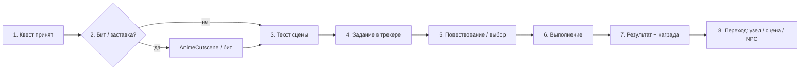

# Канон «шага сюжета»: квест как сцена

Документ фиксирует **целевой пайплайн** нарратива в Volodka: от принятия квеста до перехода к следующему шагу. Параллельно указывает, **какой слой кода** в репозитории за что отвечает — чтобы дизайн, новые сцены и чистка UX опирались на одну модель.

**Связь с золотой линией:** `src/data/goldenPath.ts`, канон сюжетных узлов `src/data/storyNodes.ts`, квесты `src/data/quests.ts`. Перед существенными правками сюжета/квестов: `npx vitest run src/data/goldenPath.test.ts src/data/narrativePoetryIntegrity.test.ts` (см. `.cursor/rules/narrative-poetry-golden-path.mdc`).

---

## 1. Целевой пайплайн (логика)

| # | Шаг | Смысл для игрока |
|---|-----|------------------|
| 1 | **Принятие квеста** | Квест появляется в журнале (📋) как активный; ясно, к какой ветке сюжета / фракции / быту относится. |
| 2 | **(Опц.) Заставка / бит** | Короткий полноэкранный «вдох» (кинематограф) — не обязателен в каждой сцене, но каноничен на стартах, поворотах, стихе/ачивке. |
| 3 | **Текст сцены** | Основной нарратив (или «бегущий» акцент в той же подаче) — *где* мы, *какой тон*, *какой конфликт*. |
| 4 | **Явное задание** | Одна мыслимая «крючковая» цель в голове игрока, дублируемая в UI (трекер / цель шага). |
| 5 | **Повествование / выбор** | VN-выборы, диалог NPC, внутренний монолог — меняет состояние, флаги, карму, ссылки на следующий узел. |
| 6 | **Выполнение** | **Один или нескло** механических носителей: сцена `scene`, мини-игра, 3D-обход, терминал 💻, взаимодействия по `E`. |
| 7 | **Результат + награда** | Обратная связь: текст результата, цифры/предметы/опыт, при необходимости уведомления (`showEffectNotif` и панели). |
| 8 | **Переход** | Смена `currentNodeId` (сюжет), `sceneId` / 3D-локация, **следующий** NPC/диалог по данным, без «обрыва». |

*«Бегущий текст»* в таблице — не отдельный движок, а **режим подачи** основного текста (акцент на динамике/напряжении); технически это тот же слой `StoryRenderer` / ноды, если нет отдельного компонента typewriter.

---

## 2. Схема (Mermaid)

Параллельно игрок может открывать **📋 Квесты** и **💻 Терминал**; они не отменяют шаги 1–8, а встраиваются в шаг 6 (и частично в 7) для IT-цепочек.

---

## 3. Привязка к коду (ориентир для реализации)

| Узел пайплайна | Типовые механизмы в репо |
|----------------|-------------------------|
| Принятие квеста | `questOperations: { type: 'start', questId }` в `storyNodes` → `questMetaStore` / `gameStore.activateQuest`; журнал: `QuestTracker`, `questMetaStore` |
| Заставка / бит | `StoryNode.cutscene` + `useGameRuntime` (сюжет); шина `eventBus` (`quest:*`, `poem:collected`, `achievement:unlocked`, `cinematic:story_after_choice`); `AnimeCutscene` + `getCutsceneById` из `animeCutscenes.ts`; дефолты: `cinematicQuestDefaults.ts` |
| Текст + выбор | `STORY_NODES` → `StoryRenderer` в `GameOrchestrator` при `showStoryOverlay` |
| Диалог NPC | `DialogueRenderer` + `npcDefinitions` + эффекты `DialogueEngine` (`questStart`, `questObjective`, …) |
| Явное задание | `QUEST_DEFINITIONS` + `QuestTracker` + при обходе подсказки `getExplorationSceneObjectiveLines` и граф 3D-квестов |
| 3D / сцена | `gameMode === 'exploration'` → `RPGGameCanvas` / `sceneManager` / `travelToScene` из `useGameRuntime`; обход: `InteractionRegistry`, триггеры квестов |
| Терминал | `ITTerminal.tsx` — команды с `questObjective` / флагами |
| Результат + награда | `effect` на узлах, `createReward` в квестах, `completeQuest` в `gameStore`, `runQuestCompletionScan` / фракции в `questEvents` |
| Переход | `usePlayerStore.setCurrentNode` / `autoNext` в данных; для выбора после бита — `pendingCinematicAfterRef` + `completeCutscene` в `useGameRuntime` |

**Координация слоёв:** `GameOrchestrator` навешивает `StoryRenderer`, `DialogueRenderer`, `AnimeCutscene`, `PoemRevealOverlay`, `QuestTracker`, `HUD` — порядок отрисовки и `AnimatePresence` задают, что перекрывает что при одновременном срабатывании (заставка > оверлей сюжета, см. `activeCutscene`).

---

## 4. Кратко: известные «съезды» (детали — §6)

- Гонка **microtask** у заставок — см. `activeCutsceneIdRef` в `useGameRuntime`.
- Расхождение **узел сюжета** vs **3D-локация** в хабе — см. `useGameScene` + `isExplorationHubStoryNodeId`.

---

## 5. Референс-флоу для выравнивания контента

**Канон (четыре среды):** подробно — [quest-reference-template.md](quest-reference-template.md): эталонные квесты `whitehat_uat_sprint` (офис), `first_words` (дом), `first_reading` (кафе), `exploration_zarema_hearth` (обход) и расширенный 3D — `exploration_volodka_rack`. Каждый — полный путь *принятие → выполнение → награда* в данных (`stageType`, `hint`, привязки к `STORY_NODES` / 💻 / триггерам). Остальные квесты **подтягивать** к чеклисту из того файла (§3).

1. **Офис, один полный сюжетный круг:** `start` → `start_diagnosis` → (квесты + 💻) → `fix_success` / обед.  
2. **Дом + стих** — `evening_choice` / `write_evening` (мини-игра) → результат.  
3. **3D** — `explore_hub_welcome` → ветка `exploration_zarema_hearth` или `exploration_volodka_rack` до награды.

Новые сцены **подгонять** под тот же ритм, пока порт сюжета не станет **предсказуем** по UX.

---

## 6. Сверка с реалом: где сейчас «рвётся» цепочка

Ниже — не мораль, а **инженерный аудит** связок `STORY_NODES` + `animeCutscenes` + `useGameRuntime` (cutscene) + VN в `GameOrchestrator` + `ITTerminal` + 3D-хаб `explore_*`. Цель: знать, что **задумано**, а что **дыра UX/лора**.

### 6.1. VN-оверлей (`StoryRenderer`) и `gameMode`

- **Где:** `useGameUiLayout` → `showStoryOverlay`; рендер в `GameOrchestrator` (блок `AnimatePresence` + `StoryRenderer`).
- **Когда показывается:** `phase === 'game'`, у узла есть контент по правилу `storyNodeShowsStoryOverlay` (`src/lib/storyOverlayEligibility.ts`: текст, выборы, `autoNext`, типы `poem_game` / `interpretation`).
- **Когда скрывается:** `gameMode === 'dialogue' | 'cutscene'` — тогда VN **не** ведёт ленту, пока открыт полноэкранный диалог/режим катсцены 3D-интро. В **exploration** (дефолт) и **combat** — оверлей **разрешён**, если узел «не пустой».
- **Разрыв A — пустой хаб:** у `explore_mode` нет текста/выборов **намеренно** — оверлея нет, игрок в «чистом» 3D; вступление — `explore_hub_welcome` (`src/data/explorationHubStory.ts`). Иначе игрок бы дублировал стену текста поверх хаба без нужды.
- **Разрыв B — нет отдельного `gameMode` «только VN»:** в типе `GameMode` только `exploration | dialogue | cutscene | combat` (`rpgTypes.ts`). Сюжетная лента **всегда** идёт как оверлей **поверх** 3D, если `showStoryOverlay === true`. Это **склейка**, а не отдельный движок; фон 3D может **не совпадать** с `scene` узла, если `currentNodeId` и `exploration.currentSceneId` разъехались (см. 6.3).

### 6.2. Полноэкранные заставки / биты (`animeCutscenes` + `useGameRuntime`)

- **Сюжетные id из ноды:** `STORY_NODES[node].cutscene` → `useEffect` в `useGameRuntime` (очередь `queueMicrotask`, ключ завершения на узел).
- **Биты квестов / стихов / ачивок:** `eventBus` + подписки в `useGameRuntime` → `requestCutscene` / `pendingCinematicAfterRef` (сюжетный выбор, reveal стиха после бита).
- **Слой в UI:** `AnimeCutscene` рисуется **после** `StoryRenderer` в `GameOrchestrator` → заставка **визуально перекрывает** VN (ожидаемо).
- **Разрыв C — нет данных по id:** если `getCutsceneById(activeCutsceneId)` вернул `undefined`, `GameOrchestrator` пишет предупреждение в консоль и вызывает `completeCutscene` — **обрыв без текста для игрока** (нужен маппинг id в `animeCutscenes.ts`).
- **Разрыв D — очередь событий в одном кадре:** старт сюжетной заставки, бит квеста, стих и ачивка могли перетирать друг друга; сейчас **частично** сглажено синхронным `activeCutsceneIdRef` в `useGameRuntime` + повторная проверка в microtask `requestCutscene` (детали в коде). Полный «коллапс» всё ещё возможен при **новых** комбинациях событий — регрессия: ручной проход.
- **Разрыв E — оверлей стиха (`revealedPoemId`)** после чужой заставки уходит в **deferred** + `completeCutscene`; игрок **не** видит reveal в тот же кадр, что бит — это **согласованный** разрыв по времени, не дублирование пайплайна.

### 6.3. `STORY_NODES` (сцена узла) и 3D-хаб `explore_*`

- **Мост:** `useGameScene` вычисляет `currentSceneId` из `STORY_NODES[currentNodeId].scene` и передаёт в `useGameRuntime` **и** `explorationCurrentSceneId` (фактическая 3D-сцена).
- **Хаб:** если `isExplorationHubStoryNodeId(currentNodeId)` — для квестов `location_visited` и прогресса в `useQuestProgressBridge` берётся **`explorationCurrentSceneId`**, а не `scene` узла (`useGameScene` комментарий: не перетирать хаб сменой сцены узла).
- **Разрыв F — сюжет говорит «офис» (`office_morning`), 3D показывает комнату Заремы:** возможно, если `currentNodeId` ещё `start` / `start_2` / `start_diagnosis`, а игрок уже **перешёл** в 3D к другой локации, или наоборот. Это **лудонарративный** разъезд: текст и фон **не гарантируют** одно место без дисциплины `setCurrentNode` при телепортах. Лечение дизайном: не менять 3D без смены узла, или в узле писать «теле-, не здесь».
- **Explore-триггеры:** `handleExplorationStoryTrigger` в `GameOrchestrator` — сначала опционально `requestCutscene` + `pendingStoryAfterExplorationCutsceneRef` (потом `setCurrentNode` после `completeCutscene`); иначе сразу `setCurrentNode`. **Разрыв** при отмене/пропуске: нужно, чтобы `storyNodeId` в данных был валиден (иначе пустой переход).

### 6.4. `ITTerminal` (💻) vs сюжет

- **Где:** панель `panels.terminal` → динамический `ITTerminal` в `GameOrchestrator` (`HUD` открывает кнопку 💻).
- **Связь с квестами:** команды `COMMANDS` в `ITTerminal.tsx` пишут прогресс через `questObjective` / `questObjectives` **без** проверки `currentNodeId` или `scene` узла.
- **Разрыв G — глобальная «лаборатория»:** подсказки в квестах говорят «в офисе / в 💻»; **фактически** команда срабатывает **в любой** сцене, как только панель открыта. Игровая честность — на совести текста; технически это **оторвано** от VN и от 3D-локации.
- **Разрыв H — `terminal_used`:** `useQuestProgress` эмитит `terminal_used`; **не** все цели в `questEvents`/`EVENT_OBJECTIVE_MAP` на него завязаны (часть только на конкретные команды из терминала через эффекты) — **не баг**, но два канала (карта событий vs жёсткий `questObjective` в `ITTerminal`).

### 6.5. Сводка «что чинить в первую очередь» (приоритет)

| Приоритет | Тема | Действие |
|-----------|------|----------|
| P0 | Id заставки без `animeCutscenes` | **Закрыто в CI:** `contentValidator.test.ts` — `StoryNode.cutscene`, `StoryChoice.cutsceneId`, поля квестов `cutsceneOnStart` / `OnComplete` / `OnObjective`; `npcExplorationIntegrity.test.ts` — `STORY_TRIGGERS[].cutsceneId` |
| P1 | Текст сюжета vs 3D-локация | Координация `setCurrentNode` + выход из/в хаб, подсказки в узлах |
| P2 | 💻 вне «офиса» | Опц.: soft-gate по `questSceneId` / флагу, или оставить как diegetic «удалёнка» в тексте |
| P2 | Регресс cutscene-очереди | E2E / чеклист: офис + стих + квест + ачивка в одной сессии |

---

*Документ: канон **Фазы A** + раздел 6 (сверка с реалом, 2026). Дальше — фазы про инвентарь, карму, портреты, мёртвый код (см. роадмап).*
