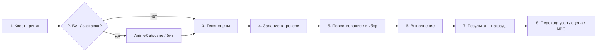

# Канон «шага сюжета»: квест как сцена

Документ фиксирует **целевой пайплайн** нарратива в Volodka: от принятия квеста до перехода к следующему шагу. Параллельно указывает, **какой слой кода** в репозитории за что отвечает — чтобы дизайн, новые сцены и чистка UX опирались на одну модель.

**Связь с золотой линией:** `src/data/goldenPath.ts`, канон сюжетных узлов `src/data/storyNodes.ts`, квесты `src/data/quests.ts`. Перед существенными правками сюжета/квестов: `npx vitest run src/data/goldenPath.test.ts src/data/narrativePoetryIntegrity.test.ts` (см. `.cursor/rules/narrative-poetry-golden-path.mdc`).

---

## 1. Целевой пайплайн (логика)

| # | Шаг | Смысл для игрока |
|---|-----|------------------|
| 1 | **Принятие квеста** | Квест появляется в журнале (📋) как активный; ясно, к какой ветке сюжета / фракции / быту относится. |
| 2 | **(Опц.) Заставка / бит** | Короткий полноэкранный «вдох» (кинематограф) — не обязателен в каждой сцене, но каноничен на стартах, поворотах, стихе/ачивке. |
| 3 | **Текст сцены** | Основной нарратив (или «бегущий» акцент в той же подаче) — *где* мы, *какой тон*, *какой конфликт*. |
| 4 | **Явное задание** | Одна мыслимая «крючковая» цель в голове игрока, дублируемая в UI (трекер / цель шага). |
| 5 | **Повествование / выбор** | VN-выборы, диалог NPC, внутренний монолог — меняет состояние, флаги, карму, ссылки на следующий узел. |
| 6 | **Выполнение** | **Один или нескло** механических носителей: сцена `scene`, мини-игра, 3D-обход, терминал 💻, взаимодействия по `E`. |
| 7 | **Результат + награда** | Обратная связь: текст результата, цифры/предметы/опыт, при необходимости уведомления (`showEffectNotif` и панели). |
| 8 | **Переход** | Смена `currentNodeId` (сюжет), `sceneId` / 3D-локация, **следующий** NPC/диалог по данным, без «обрыва». |

*«Бегущий текст»* в таблице — не отдельный движок, а **режим подачи** основного текста (акцент на динамике/напряжении); технически это тот же слой `StoryRenderer` / ноды, если нет отдельного компонента typewriter.

---

## 2. Схема (Mermaid)

Параллельно игрок может открывать **📋 Квесты** и **💻 Терминал**; они не отменяют шаги 1–8, а встраиваются в шаг 6 (и частично в 7) для IT-цепочек.

---

## 3. Привязка к коду (ориентир для реализации)

| Узел пайплайна | Типовые механизмы в репо |
|----------------|-------------------------|
| Принятие квеста | `questOperations: { type: 'start', questId }` в `storyNodes` → `questMetaStore` / `gameStore.activateQuest`; журнал: `QuestTracker`, `questMetaStore` |
| Заставка / бит | `StoryNode.cutscene` + `useGameRuntime` (сюжет); шина `eventBus` (`quest:*`, `poem:collected`, `achievement:unlocked`, `cinematic:story_after_choice`); `AnimeCutscene` + `getCutsceneById` из `animeCutscenes.ts`; дефолты: `cinematicQuestDefaults.ts` |
| Текст + выбор | `STORY_NODES` → `StoryRenderer` в `GameOrchestrator` при `showStoryOverlay` |
| Диалог NPC | `DialogueRenderer` + `npcDefinitions` + эффекты `DialogueEngine` (`questStart`, `questObjective`, …) |
| Явное задание | `QUEST_DEFINITIONS` + `QuestTracker` + при обходе подсказки `getExplorationSceneObjectiveLines` и граф 3D-квестов |
| 3D / сцена | `gameMode === 'exploration'` → `RPGGameCanvas` / `sceneManager` / `travelToScene` из `useGameRuntime`; обход: `InteractionRegistry`, триггеры квестов |
| Терминал | `ITTerminal.tsx` — команды с `questObjective` / флагами |
| Результат + награда | `effect` на узлах, `createReward` в квестах, `completeQuest` в `gameStore`, `runQuestCompletionScan` / фракции в `questEvents` |
| Переход | `usePlayerStore.setCurrentNode` / `autoNext` в данных; для выбора после бита — `pendingCinematicAfterRef` + `completeCutscene` в `useGameRuntime` |

**Координация слоёв:** `GameOrchestrator` навешивает `StoryRenderer`, `DialogueRenderer`, `AnimeCutscene`, `PoemRevealOverlay`, `QuestTracker`, `HUD` — порядок отрисовки и `AnimatePresence` задают, что перекрывает что при одновременном срабатывании (заставка > оверлей сюжета, см. `activeCutscene`).

---

## 4. Когда шаги «съезжают» (для будущей полировки)

- **Двойной старт заставок** в одном кадре — в коде выровнено через `activeCutsceneIdRef` + синхронное обновление в `useGameRuntime` (см. коммиты вокруг конкурирующих microtask).
- **Квест активирован, сюжет ещё не в офисе** — часть IT-цепочек намеренно вешается с узла `start_diagnosis` (и соседей); 3D-хаб в другом «акте смены» — **не баг шаблона**, а привязка сценария к *окну повествования*.

---

## 5. Референс-флоу для выравнивания контента (идея)

1. **Офис, один полный круг:** `start` → `start_diagnosis` → (квесты + 💻) → `fix_success` / обед.  
2. **Дом + стих** — `evening_choice` / `write_evening` (мини-игра) → результат.  
3. **3D** — `explore_hub_welcome` → одна квестовая ветка обхода (Zarema/Volodka) до награды.

Новые сцены **подгонять** под тот же ритм, пока весь порт сюжета не станет **предсказуемо** по UX.

---

*Документ введён в рамках **Фазы A** дорожной карты: канон «квест = сцена» зафиксирован до дальнейшей доработки инвентаря, кармы, портретов и мёртвого кода.*
